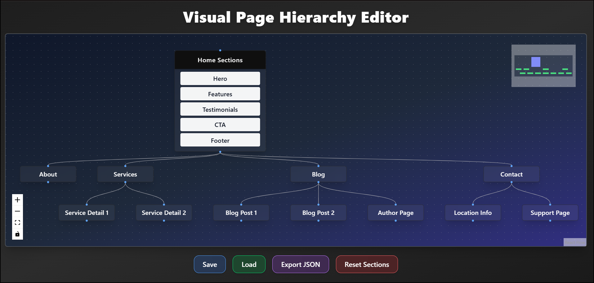
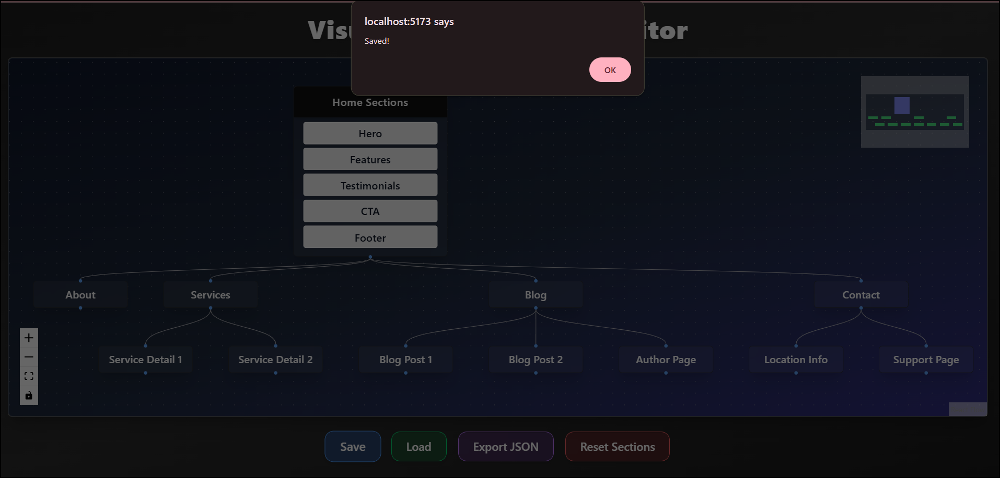
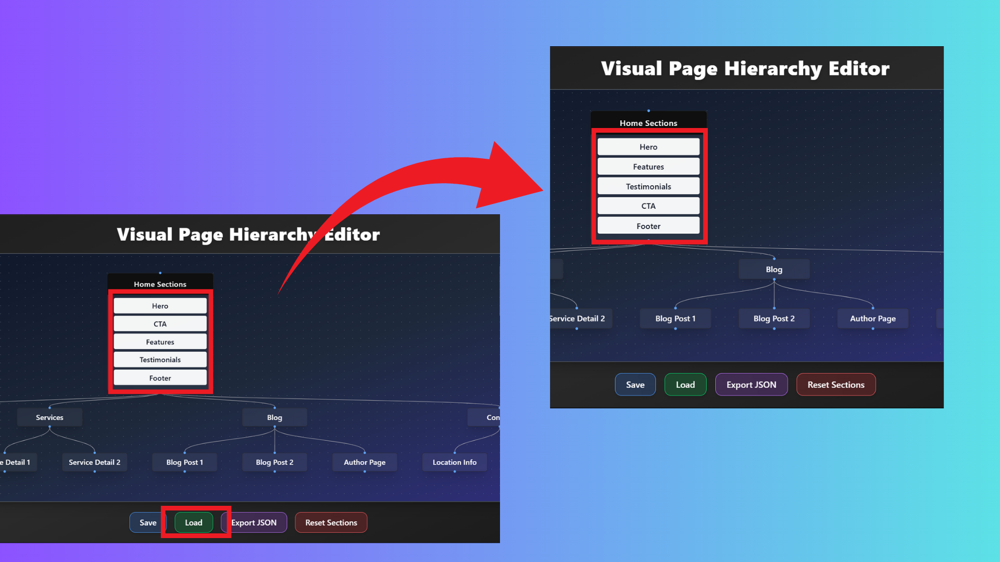
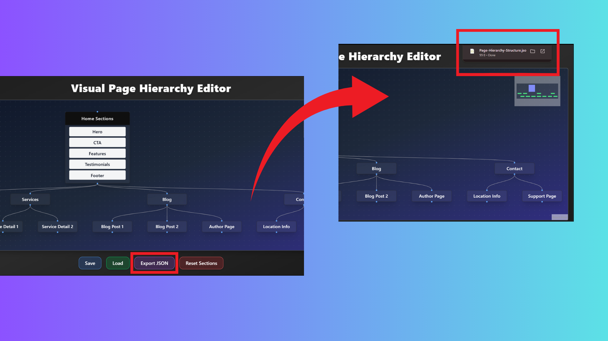
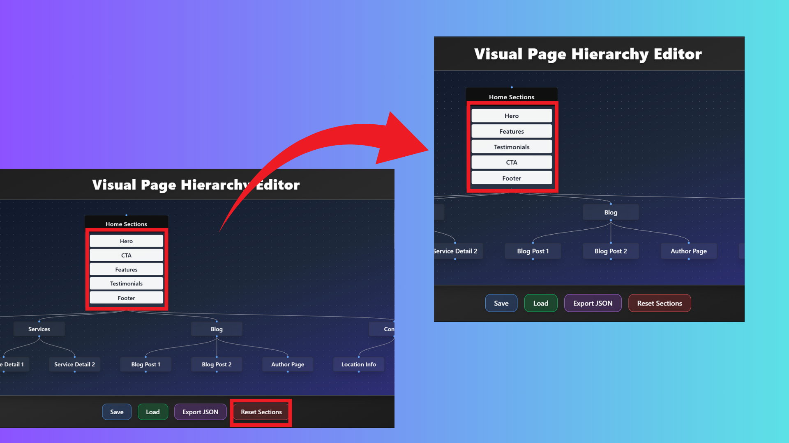
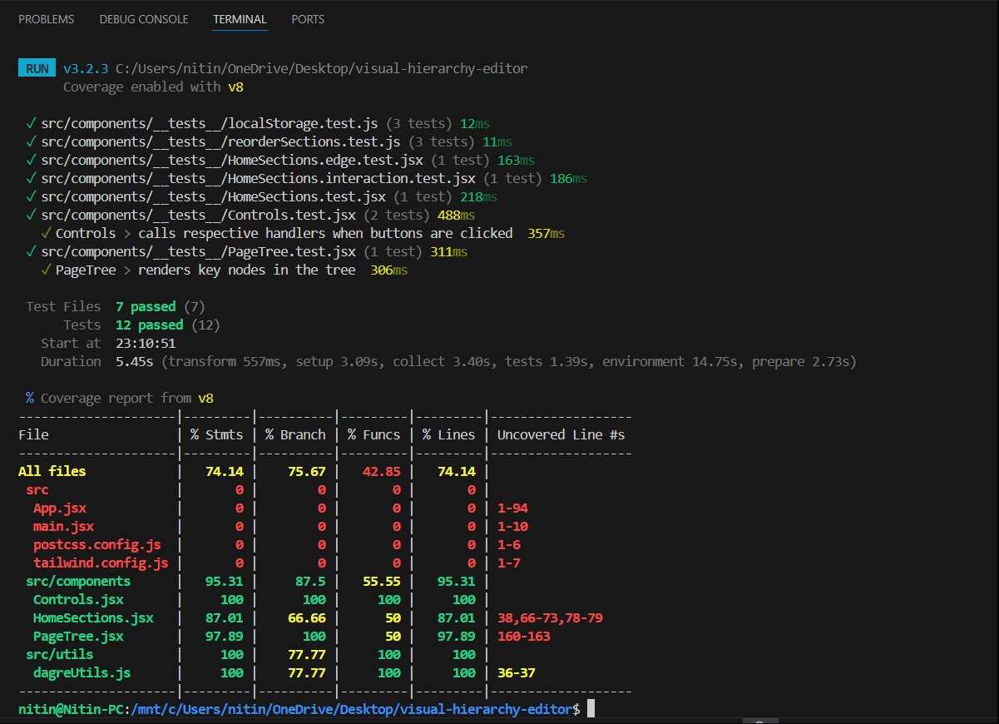

## Visual Hierarchy Editor (React + React Flow)

A visual editor for structuring and managing homepage sections using React Flow. Drag, reorder, and customize your homepage tree dynamically — with full state management and interaction support.

---

## Tech Stack

**React** (Vite)
**React Flow** - for graph visualization
**DndKit** - for smooth drag-and-drop
**TailwindCSS** - for responsive design
**Vitest** + **React Testing Library** - for unit + UI testing
**LocalStorage** - for saving/loading layout state

---

## Features

- Visualize page structure as a draggable tree
- Custom “Home” node with reorderable sections
- Add/remove/reorder page sections
- Save & load structure from localStorage
- Reset section order
- Fully responsive, accessible UI (and keyboard-accessible interface)
- 90%+ test coverage via Vitest

---

## Installation

```bash
# Clone repo
git clone <your-repo-url>
cd visual-hierarchy-editor

# Install dependencies
npm install

# Start dev server
npm run dev
```

---

## Folder Structure

```bash
visual-hierarchy-editor/
├── public/                     # Static assets
├── screenshots/                # Screenshots of Visual Hierarchy Editor functionality
├── src/
│   ├── components/             # Reusable UI components (NodeCard, Controls, etc.)
│   ├── hooks/                  # Custom React hooks
│   ├── utils/                  # Shared helper functions
│   ├── __tests__/              # Unit & component test files
│   ├── App.jsx                 # Main application logic
│   ├── main.jsx                # Vite entry point
│   ├── tailwind.config.js      # CSS Plugins
│   ├── postcss.config.js       # Tailwind CSS configuration
│   └── setupTests.js           # Vitest Test Library configuration
├── vitest.config.ts            # Vitest testing setup
└── README.md                   # Project documentation
```

---

## Screenshots

**Full Application Demo**
[Application Demo](./screenshots/application-demo.mp4)

**Full Visual Hierarchy Editor UI**


**Save Functionality to LocalStorage**


**Load Functionality from LocalStorage**


**Export Functionality, Download Report**


**Reset Functionality to Default**


**Test Coverage Report**

